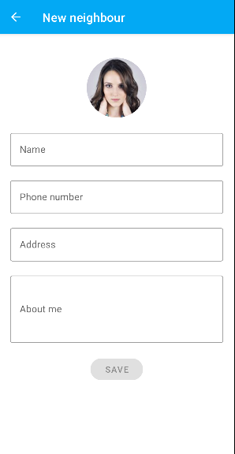
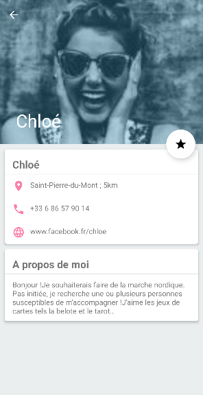

<div align="center">
  <a href="https://github.com/Durgle/OpenClassrooms_P3_Entrevoisins">
    
  </a>
</div>

## About The Project

This repository contains a mini application that lists neighbours. This application allows for deleting, adding, viewing, and adding neighbours to favorites.

## Getting Started

### Installation

_Below is an example of how you can instruct your audience on installing and setting up your app. This template doesn't rely on any external dependencies or services._

1. Clone the repo
   ```sh
   git clone https://github.com/Durgle/OpenClassrooms_P3_Entrevoisins.git
   ```
2. Open the project with **[Android Studio](https://developer.android.com/studio)**
3. Start the app with this button 

<!-- EXAMPLES -->
## Preview

<figure style="text-align:center">
  
  <figcaption>Screenshot of the neighbors list.</figcaption>
</figure>

<figure style="text-align:center">
  
  <figcaption>Screenshot of the neighbor addition page.</figcaption>
</figure>

<figure style="text-align:center">
  
  <figcaption>Screenshot of the neighbor details page.</figcaption>
</figure>


